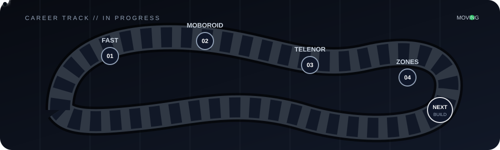

<div align="center">

# Haroon Waheed

### Software Engineer · Full Stack · Backend · DevOps · AI


<br>

<a href="https://www.linkedin.com/in/haroon--waheed/"></a>  <a href="https://haroons-portfolio-one.vercel.app/"></a>

</div>

---

<div align="center">



</div>

---

## 👋 About Me

I'm a Software Engineer who enjoys turning ideas into products that people can actually use.

My work sits around **full-stack development, backend engineering, DevOps, cloud infrastructure, and AI-powered applications**. I enjoy understanding how everything connects, from the frontend interface to APIs, databases, deployments, and infrastructure.

Currently working at **Zones IT Solutions**, where I'm getting exposure across different areas of software engineering and continuously expanding my technical range.

Outside of work, I'm usually experimenting with something new, building side projects, exploring tools, or figuring out how to make an idea work.

---

## 🛠️ Tech Garage

### Frontend

<p>

</p>

### Backend

<p>

</p>

### Databases

<p>

</p>

### DevOps & Cloud

<p>

</p>

---

## 🚀 Selected Builds

<table>
<tr>

<td width="50%">

### 🤝 Splash

AI-powered brand & influencer collaboration platform.

**Stack**

`Next.js` · `TypeScript` · `Node.js` · `MongoDB` · `AI` · `Stripe`

AI matching, recommendation engine, campaigns, analytics, chatbot, encrypted messaging, affiliate tracking and subscription management.

</td>

<td width="50%">

### 🔐 E2E Messaging

Real-time encrypted messaging application.

**Stack**

`MERN` · `Socket.IO` · `AES` · `RSA`

Built around real-time communication with client-side encryption and secure message exchange.

</td>

</tr>

<tr>

<td width="50%">

### ☁️ AWS Infrastructure

Cloud infrastructure and deployment projects using AWS.

**Stack**

`AWS` · `EC2` · `RDS` · `VPC` · `ALB` · `Secrets Manager`

Designed and deployed multi-service infrastructure with networking, database and application components.

</td>

</tr>
</table>

---

## 🔭 Currently Exploring

```text id="z2x8nq"
AI Engineering       █████████████████░░░
System Design         ███████████████░░░░
Cloud & DevOps        ████████████████░░░
Automation            ██████████████░░░░░
Blockchain            ██████████░░░░░░░░░
```

---

## 💡 What I Like Building

<p align="center">

`SaaS`   `AI Applications`   `APIs`   `Automation`

`Cloud Systems`   `Developer Tools`   `Real-time Apps`

</p>

---

<div align="center">

### 🏁 FINISH LINE

<br>

<a href="https://linkedin.com/in/haroon--waheed">

</a>

   

<a href="https://haroons-portfolio-one.vercel.app/">

</a>

<br><br>

<sub>LEARN → BUILD → SHIP → REPEAT</sub>

</div>
